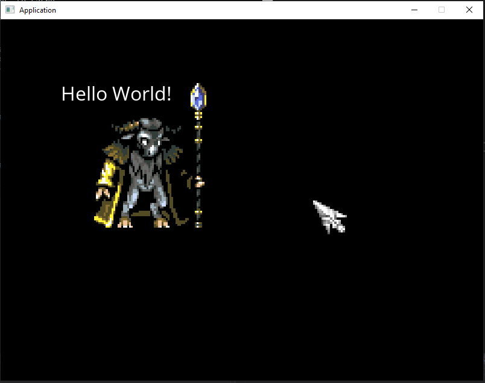
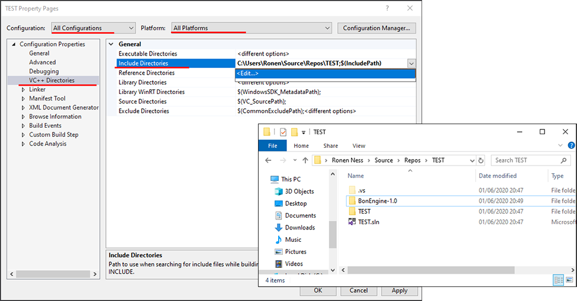
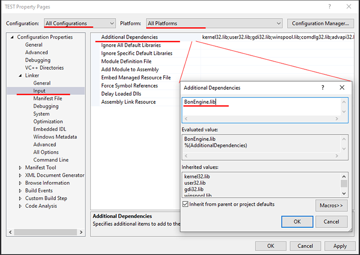
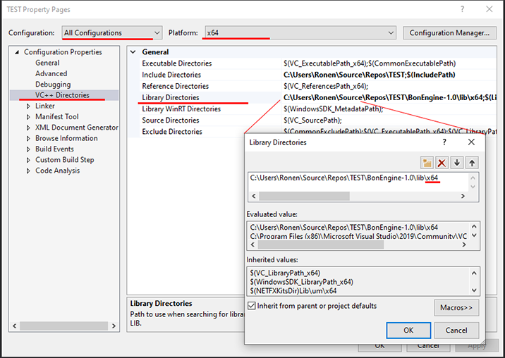
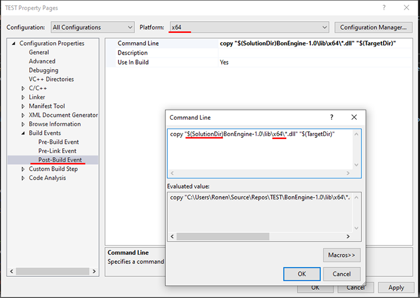
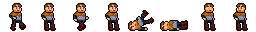

`BonEngine` is a game engine designed to be simple and straightforward, with as little setup as possible. 
Your game can be designed as OOP or procedural, everything goes.

## C# Bind

If you're looking for a C# bind of this engine, you can find it [here](https://github.com/RonenNess/BonEngineSharp).

## Table of Contents

1. [Example](#example)
2. [About](#about)
3. [Setup](#setup)
4. [Scene](#scene)
5. [Assets](#assets-1)
6. [Managers](#managers)
7. [Sprites](#sprites)
8. [Config](#config)
8. [Effects](#effects)
8. [Features](#features)
9. [License](#license)

## Example

Before diving into details, lets take a look at a basic example. 
Inside the `BonTest/` folder in this repo you can find plenty of basic examples to learn from, but lets lay down one here as well.

The code below will draw a sprite, a custom cusor, and some text:

```cpp
#include <BonEngine.h>

/**
 * Basic bon example.
 */
class HelloWorldScene : public bon::engine::Scene
{
private:
	bon::FontAsset _font;
	bon::ImageAsset _cursorImage;
	bon::ImageAsset _spriteImage;

public:

	// called when scene load, before main loop starts.
	virtual void _Load() override
	{
		// init game configuration from ini file (optional, there are also defaults or you can set everything from code).
		Game().LoadConfig("TestAssets/config.ini");
	
		// load assets
		_cursorImage = Assets().LoadImage("TestAssets/gfx/cursor.png");
		_spriteImage = Assets().LoadImage("TestAssets/gfx/gnu.png");
		_font = Assets().LoadFont("TestAssets/gfx/OpenSans-Regular.ttf");
	}

	// per-frame updates
	virtual void _Update(double deltaTime) override
	{
		// when player click the key assigned to action 'exit', will exit game
		if (Input().Down("exit")) { Game().Exit(); }
	}

	// drawing - called every frame to draw game
	virtual void _Draw() override
	{
		// clear screen
		Gfx().ClearScreen();

		// draw text
		Gfx().DrawText(_font, "Hello World!", bon::PointF(100, 100));

		// draw test sprite
		Gfx().DrawImage(_spriteImage, bon::PointF(120, 100), &bon::PointI(256, 256));

		// draw cursor
		Gfx().DrawImage(_cursorImage, Input().CursorPosition(), &bon::PointI(64, 64));
	}
};

// init game
void main()
{
	auto scene = HelloWorldScene();
	bon::Start(scene);	
}
```

And result would look like this:



So what can we learn from this demo? 

1. Game logic is implemented by `Scenes` (a scene = level or game screen).
2. The engine's API is divided into subsystems (called managers). 
3. Above we meet the `Assets()`, `Input()`, `Gfx()` and `Game()` managers.

Now lets continue and delve into `BonEngine`.


## About

So what is `BonEngine` exactly? `BonEngine` is a 2d game engine that covers graphics, sounds, input and miscs, and aims to provide a simple, straightforward framework for people who want to make games with code.

Since `BonEngine` is built around SDL you can look at it as the comfy SDL layer between you and the low-level SDL APIs that comes with memory management. `BonEngine` does all the "boring stuff" you'd want to do when picking up SDL for a fresh project, so you're left with just the game implementation  :)

Note that while the default implementation is based on SDL, every part of `BonEngine` is replaceable and you can inject your own implementation for things. In addition `BonEngine` is not just a wrapper, and as we'll see shortly goes beyond that and implement some nice utilities every game dev would enjoy having.

### Principles

`BonEngine` APIs stick to the following principles as much as possible:

1. *Near-Zero Setup*: with the exception of loading assets, there's barely anything to create or init to make your game run.
2. *No Bloat*: the APIs of the managers are kept to necessary minimum. Advanced low level APIs are still available, but hidden.
3. *Flexible*: you can replace any subsystem with your own, or create and register new ones.
4. *Readability*: the APIs are designed to be as clear as possible. You should be able to guess everything without the docs.
5. *Procedural API*: BonEngine is OOP and made with classes, but its API is mostly stateless methods you can call directly or utilize in an OOP design.

In addition, and it's not much of a principal but something to remember, if a class or method starts with an _underscore, it means its internal and you should probably not call it unless you know what you're doing. These were left exposed to give more control, but normally you should ignore them.

### Platforms

`BonEngine` was developed and built on windows desktop; However, since its using SDL and std and nothing windows-specific, it should be relatively easy to build for other SDL-supported platforms.

# Setup 

This section explains how to setup `BonEngine` for `Visual Studio` (in this example 2019).

## 1. Create New Project

Create a new CPP project, either `Empty Project` or `Console App`. Do not create a windows application or dll.

## 2. Download Files

Download the dev distribution. Download file `Build/BonEngine-X.Y.zip` from this repo, where X.Y is the version of your choice (latest is recommended).

Extract the zip into your solution or project folder.

## 3. Add Include Folder

Open project properties and go to `VC++ Directories` --> `Include Directories`. Add the folder containing the folder you extracted (`BonEngine-1.0`). This way you can use:

```cpp
#include <BonEngine-1.0/include/BonEngine.h>
```

To include `BonEngine` main stuff.

Make sure you do this for all platforms and all configurations.



## 4. Add BonEngine.lib

Open project properties and go to `Linker` --> `Input` --> `Additional Dependencies`. Add dependency to `BonEngine.lib`.

Make sure you do this for all platforms and all configurations (we separate between x64 / x86 platforms in next step).



## 5. Add Library Directories

Open project properties and go to `VC++ Directories` --> `Library Directories`. Add folder `BonEngine-1.0\lib\x64` for x64 platform, and `BonEngine-1.0\lib\x86` for x86. This trick will make the linker load the correct lib when compiling.



## 6. Copy Dlls

So far we set everything we need to build the project. However, if we try to run it you'll see it can't find the runtime dlls. Easiest way to solve this is to add post-build command to copy them. 

Open project properties and go to `Post-Build Event` --> `Command line` and type the following for x64 platform:

`copy "$(SolutionDir)BonEngine-1.0\lib\x64\*.dll" "$(TargetDir)"`

And the following for x86:

`copy "$(SolutionDir)BonEngine-1.0\lib\x64\*.dll" "$(TargetDir)"`

**Note**: if you put `BonEngine-1.0` folder inside the project dir and not the solution dir, replace `$(SolutionDir)` with `$(ProjectDir)`.

Try to build to test if post command works.



## 7. Write Some Code

Now its finally time to write some code. Lets start with a minimal setup example:

```cpp
#include <BonEngine-1.0/include/BonEngine.h>

/**
 * An empty BonEngine scene.
 * You can start override _Start, _Update, _FixedUpdate, _Draw, _Load and _Unload to add game logic.
 */
class MyScene : public bon::engine::Scene
{

};


// main - create and init scene
int main()
{
	MyScene scene;
	bon::Start(scene);
}
```

That's it! The code above will create an empty, black screen. Now its time to implement some game logic, which we'll learn how to do next..


# Engine Details

In this section we'll delve into the engine and how to use it.

## Scene

Lets talk about the scene, the main object to implement your game's logic. A scene is an object that represent a game screen, a level, or a layer in your game.
You use them to implement your game main loop and drawing loop. You can also stack together scenes to create layers of responsibility, for example one scene for the game itself, and another for HUD.

A scene must publicly inherit from `bon::engine::Scene`, and may implement the following methods, which are triggered by the engine itself (you don't need to call them):

#### void _Load()

Called the moment the scene is set as the active scene. When its the first scene you initialize the game with, some managers may not be fully initialized yet. 
This is also an advantage, as it gives you an opportunity to setup things before the default initialization happens, or register your own custom managers.

The `_Load` method is a good place to load assets (as name implies) and to set configuration, if its the first scene loaded.

#### void _Unload()

Called when the scene becomes inactive, ie replaced by another scene. 
Typically you don't need to do anything special here, as assets are released automatically. 
However, this method is a good opportunity to cleanup custom resources you may have used outside the engine (for example if you opened some files).

#### void _Start()

Similar to `_Load`, but this method is guaranteed to be called only after everything was initialized. 
When you switch a scene after the game has already started, first the new scene's `_Load` will be called, then immediately after `_Start` will be triggered.

#### void _Update(deltaTime)

Called every frame to do game-related updates. This is your game's main loop.
`deltaTime` is the time passed, in seconds, since the last `_Update()` was called.

Use this method for animations, input, collision checks, and most of your game logic.

Typically we'll have a rate of 60 updates per second.

#### void _FixedUpdate(deltaTime)

Fixed updates are called with a constant interval (meaning in this case `deltaTime` will always have the same value). 
Note that it doesn't actually call this method with real-life constant intervals (for example you can't count real-life seconds accurately with this) but instead it calculates how many Fixed Update calls should be invoked every second, and more importantly - how many `FixedUpdates` we need to call for every regular `Update`, to ensure that over time it behaves like they run with fixed interval.

This means that there can be multiple `Fixed Updates` in a row without a single `Update` call, and similarly, there can be multiple `Updates` in a row.

`Fixed Updates` are useful for things like physics calculations.

#### void _Draw()

Called every time an `_Update` is called, right after, to draw the scene.
Typically we'll have a rate of 60 draws per second.


### Additional Scene API

While implementing the scene's methods listed above, you can use the following scene methods:

#### bool IsFirstScene()

Get if this scene is the first scene loaded into the engine. Can be used for special initialization code.

#### Game()

Get the `game` manager. Described later in details.

#### Assets()

Get the `assets` manager. Described later in details.

#### Gfx()

Get the `gfx` manager. Described later in details.

#### Sfx()

Get the `sfx` manager. Described later in details.

#### Input()

Get the `input` manager. Described later in details.

#### Log()

Get the `log` manager. Described later in details.

#### Diagnostics()

Get the `diagnostics` manager. Described later in details.

#### UI()

Get the `ui` manager. Described later in details.

#### IManager* GetManager(id)

Get a custom or built-in manager by name.
This method is not so fast so its best to cache it after getting the manager.


## Assets

An asset is a game resource you load from a file (or create your own in some cases) to use in your game. Assets are held by shared_ptr, meaning they'll get deleted automatically when you stop using them, unless put in cache.

The basic assets `BonEngine` provides are:

1. **ImageAsset**: An image you load to draw on screen. You can also create empty images and draw on them.
2. **FontAsset**: A font, used to draw text.
3. **SoundAsset**: A sound track, for sound effects.
4. **MusicAsset**: A long music track, used to play background music.
5. **ConfigAsset**: A set of configurations you can load from a standard ini file.
5. **EffectAsset**: A set of (glsl) shaders you can load and render with, for special drawing effects.

All assets are created with the assets manager, as described later.


## Initialize Engine

As seen in the example at the start of this doc, initializing the engine is quite simple. 
Once you define your game scene, you just need to call `Start()` with it:

```cpp
#include <BonEngine.h>

class MyScene : public bon::engine::Scene
{
    // scene implementation here
}

auto scene = MyScene();
bon::Start(scene);	
```

This will invoke the scene's `_Load` and `_Start` methods, and start the main loop which will invoke the `Updates` and `Draw` calls.


## Managers

Most of the engine's API are divided into a set of built-in subsystems, called Managers. 

For every Manager type we have an interface + a default built-in implementation (usually built around SDL). If you want to replace one of the managers with your own, you can override it before calling engine `Start`.

Lets explore these managers now. 


### Game

This manager is responsible for general game / application management. You get this manager with the `Game()` access method.

Usage example:

```cpp
// load configuration file
Game().LoadConfig("../TestAssets/config.ini");

// if 'exit' action is pressed, exit application
if (Input().Down("exit")) { 
    Game().Exit(); 
}
```

`Game` manager contains the following API:

#### void Exit()

Exit the game. This will not stop app immediately, it will finish only after completing current update, fixed update, and draw calls.

#### void ChangeScene(scene)

Change the currently active scene.
To make sure transition is safe, the engine will only do the switching after the current frame ends, but will skip future updates and draw calls for the replaced scene so you can start releasing resources.

#### void LoadConfig(path)

Loads game configuration from an .ini file. 
Note: this API uses the engine's `ConfigAsset`. If you replace its internal implementation, the format of the game config file may change as well.

Game config file contains sections about graphics, sound, input, etc. 

To see an example of a config file, check out `TestAssets/config.ini`, which is partially presented here:

```ini
; BonEngine default configuration

; graphics related config
[gfx]                        
title = BonEngine Application   ; window title
resolution_x = 800              ; window width (0 for desktop width)
resolution_y = 600              ; window height (0 for desktop height)
window_mode = 0                 ; 0 = windowed, 1 = borderless, 2 = fullscreen
cursor = false                  ; show cursor?

; sounds related config
[sfx]
frequency = 22050               ; sound frequency
format = 3                      ; audio format: 0 = U8, 1 = S8, 2 = U16LSB, 3 = S16LSB, 4 = U16MSB, 5 = S16MSB.
stereo = true                   ; do we support stereo sound (false for mono).
audio_chunk_size = 4096         ; smaller value = more responsive sound at the price of CPU. 2048 and 4096 are good values.


; input - assign keys to game actions
[controls]
KeyLeft=left                    ; left key will be bound to "left" action
KeyA=left                       ; 'A' key will also be bound to "left" action
KeyRight=right                  ; right key will be bound to "right" action
KeyD=right                      ; 'D' key will also be bound to "right" action

; ... there are more key binds below but its omitted to keep this example short
```

#### double ElapsedTime()

Get total seconds passed since the engine started running.

#### double DeltaTime()

Get current frame's delta time (same as you get in your `Update()` call).


### Assets

This manager is responsible for loading, creating and saving game assets. You get this manager with the `Assets()` access method.

All loading methods in this manager have a `useCache` param. If set to true (default), once asset it loaded it will also be added to cache, so next time you load it will be quick. This also means that the asset will not free itself automatically, unless you explicitly clear cache.

Usage example:

```cpp
// loads an image asset with nearest filter, and add to cache:
bon::ImageAsset image = Assets().LoadImage("../TestAssets/gfx/gnu.png", bon::ImageFilterMode::Nearest, true);

// loads config file and get string config from it
bon::ConfigAsset conf = Assets().LoadConfig("my_config.ini");
const char* strFromConf = conf->GetStr("some_section", "config_key", "default if not found");
```

`Assets` manager contains the following API:

#### ImageAsset LoadImage(path, filter, useCache)

Loads an image asset from file.

`Filter` is how to handle image when scaling it (default is nearest neighbor, which will result in crisp appearance).

#### ImageAsset CreateEmptyImage(size, filter)

Creates an empty image asset with a given size. You can later render on this image, and use it as texture for other drawing calls.

#### SoundAsset LoadSound(path, useCache)

Loads a sound file from path.

#### MusicAsset LoadMusic(path, useCache)

Loads a music file from path. Music is any sound format file, the only difference between music and sound effects is that music plays in the background on its own designated channel, and is more suitable for long tracks.

#### FontAsset LoadFont(path, fontSize, useCache)

Loads a font, used to draw text. 

`fontSize` is the native size we load the font with. This will affect how text drawn with this font looks like when you scale it. 

For example, if `fontSize` is really small, and you try to render large text, result will appear blurry. However, if you pick unnecessarily large `fontSize` just to have better quality, remember it also cost resources. So you need to find a balance based on your requirements and systems you aim to run on.

#### EffectAsset LoadEffect(path, useCache)

Loads an effect asset from file.
Path should lead to an .ini file containing effect's properties. For more info, see [Effects](#effects) section in this doc.

#### ConfigAsset LoadConfig(path, useCache)

Load a config file. You can use these files for whatever you like, by default `BonEngine` uses standard .ini files to store config.

#### ConfigAsset CreateEmptyConfig()

Creates an empty config file. You can set values into it and save it later.

#### bool SaveConfig(config, path)

Save a config asset to file.

#### void ClearCache()

Clear all assets from cache. This doesn't necessarily delete or free the assets; as long as someone continue to hold the assets externally, they will be kept alive.


### Diagnostics

This manager is responsible for performance checks and diagnostics, things like draw count, fps, etc. You get this manager with the `Diagnostics()` access method.

Usage example:

```cpp
// draw FPS count at the corner of the screen
int fps = Diagnostics().FpsCount();
Gfx().DrawText(_font, (std::string("FPS: ") + std::to_string(fps)).c_str(), bon::PointF(0, 0), &bon::Color(1, 1, 1, 1), 18);
```

`Diagnostics` manager contains the following API:

#### int FpsCount()

Get current FPS count. Note: this is not extremely accurate, for example if your game runs at 60 fps, you might sometimes see it flicker between 59 and 60 fps.

#### long GetCounter(counter)

Get diagnostic counter value.
Counters we have are:

- DrawCalls = how many draw calls we had in current frame (reset at the begining of every update loop).
- PlaySoundCalls = how many play sound calls we had in current frame (reset at the begining of every update loop).
- LoadedAssets = how many loaded / created assets we currently have.

Note that you can also use `IncreaseCounter()` and `ResetCounter()` if you want to do manual tests yourself. In addition there's a set of corresponding functions with _underscore that get int as counter id, allowing you to create and use custom counters.

Usage example:

```cpp
// get number of draw calls in current frame.
// note: call this at the end of the drawing functions to make sure it includes everything.
long drawCalls = Diagnostics().GetCounter(bon::DiagnosticsCounters::DrawCalls);
```


### Gfx

This manager is responsible for everything related to graphics and rendering. You get this manager with the `Gfx()` access method.

Usage example:

```cpp
// loads an image asset and draw it on screen at position 100, 100
bon::ImageAsset image = Assets().LoadImage("../TestAssets/gfx/gnu.png");
Gfx().DrawImage(image, bon::PointI(100, 100));

// loads a font and draw text on screen at position 100,200
bon::FontAsset font = Assets().LoadFont("../TestAssets/gfx/OpenSans-Regular.ttf");
Gfx().DrawText(font, "Hello World!", bon::PointF(100, 200));
```

`Gfx` manager contains the following API:

#### void DrawImage(image, position, size, blend)

Draw an image on screen.

* `size` - Destination size, or null to use image's full size.
* `blend` - Drawing blend mode (opaque, alpha, additive, mod, or multiply).

#### void DrawImage(image, position, size, blend, sourceRect, origin, rotation, color)

Like the shorter `DrawImage` method, but with more arguments:

* `sourceRect` - Region from image to draw.
* `origin` - Drawing origin (will be the point of `position` + anchor for rotation).
* `rotation` - Rotate image (in degrees).
* `color` - Drawing tint color (works as multiply - for example red color will zero blue and green channels).

#### void DrawSprite(sprite, offset)

Draw a sprite. Sprites are structs that holds all the drawing parameters of the `Draw` methods. It's just a sugarcoat to make it easier to hold drawing arguments. This object is described later.

`offset` is additional offset to add to position. This makes it easier to implement camera behavior.

#### void DrawText(font, text, position, color, fontSize, maxWidth, blend, origin, rotation, outlineWidth, outlineColor)

Draw text on screen.

Note that drawing text generates temporary textures behind the scenes, so its not recommended to draw too much changing text too often. For example, if you have a really long text and you want to add a text type effect, where letters appear one by one, note it will be very wasteful.

#### void DrawLine(from, to, color, blend)

Draw a lint between two points.

#### void DrawPixel(position, color, blend)

Draw a single pixel.

#### void DrawRectangle(rect, color, filled, blend)

Draws a filled or outline rectangle.

#### void ClearScreen(color, clearRect)

Clears the screen, or if `clearRect` is provided, just a region of it.

#### void SetWindowProperties(title, width, height, windowMode, showCursor)

Recreate the window with new properties.
if `width` or `height` are set to 0, it will take full size.

#### void UseEffect(effect)

Set the currently active effect, or nullptr to use default rendering.
More info on using effects: [Effects](#effects).

#### void SetTitle(title)

Change the window's title.

#### void SetRenderTarget(image)

Start drawing to target image instead of directly on screen (render to texture). Set to nullptr to clear render target and draw back on screen.

This is an extremely useful functionality you can use for post-effects.

#### ImageAsset GetRenderTarget()

Retrieve currently set render target, or null if not set.

#### PointI WindowSize()

Get window size.

#### PointI RenderableSize()

Get the size of the area we can currently draw on.

- If viewport is set, will return viewport size.
- If render target is set, will return target size, unless there's a smaller viewport.
- If there's no render target nor viewport, will return window size.

#### SetViewport(rect)

Set a clipping rectangle that you can only draw inside. Any rendering outside the viewport will be clipped.
To remove viewport, set nullptr instead of a rectangle pointer.


### Sfx

This manager is responsible for everything related to sound and music. You get this manager with the `Sfx()` access method.

Usage example:

```cpp
// loads a music track and plays it in endless loop
bon::MusicAsset music = Assets().LoadMusic("../TestAssets/sfx/old city theme.ogg");
Sfx().PlayMusic(music);

// loads a sound effect and plays it once at volume 100
bon::SoundAsset forestSound = Assets().LoadSound("../TestAssets/sfx/Forest_Ambience.mp3");
Sfx().PlaySound(forestSound, 100)
```

`Sfx` manager contains the following API:

#### void SetAudioProperties(frequency, format, stereo, audio_chunk_size)

Set general audio properties. This reinitialize the sound device.

#### void PlayMusic(music, volume, loops)

Play a music track.

#### void PauseMusic(paused)

Pause / resume music track.

#### void SetMusicVolume(volume)

Set music volume.

#### void StopMusic()

Stop current music track.

#### SoundChannelId PlaySound(sound, volume, loops, pitch)

Plays a sound effect.

Returns a `channel id`, which is an identifier you can use later to control this sound effect. If failed to play sound (usually because we ran out of mix channels), will return `InvalidSoundChannel`.

#### SoundChannelId PlaySound(sound, volume, loops, pitch, panLeft, panRight, distance)

Plays a sound effect with extra panning and distance params.

#### void SetChannelDistance(channel, distance) 

Set volume based on distance from listener for a playing sound effect. `channel` is the channel id as returned by `PlaySound()`.

#### void SetChannelPanning(channel, panLeft, panRight) 

Set sound panning (volume on left / right sides). `channel` is the channel id as returned by `PlaySound()`.

#### void StopChannel(channel) 

Stop playing a sound effect. `channel` is the channel id as returned by `PlaySound()`.

#### void SetMasterVolume(soundEffectsVolume, musicVolume)

Set master volume for sound effects and music.


### Log

This manager is responsible for logging. You get this manager with the `Log()` access method.

Usage example:

```cpp
// using manager getter: write "Hello World!" in 'info' level
Log().Write(bon::LogLevel::Info, "Hello %s!", "World");

// using macros (recommended): write "Hello World!" in 'info' level
BON_ILOG("Hello %s!", "World");
```

`Log` manager contains the following API:

#### void Write(level, fmt, ...)

Write a log message. 

* `level` - Log level (severity).
* `fmt` - Message text, with optional arguments (%d, %f, %s...).
* `...` - Arguments for the message format.

Valid log levels are: Debug, Info, Warn, Error, Critical.

#### void SetLevel(level)

Set which log levels to write to log. Levels lower than this level, will be ignored.
For example, log level is set to Info, all Debug messages will be omitted.

#### LogLevel GetLevel()

Get current log level.

#### bool IsValid(level)

Checks if a given log level should be written to log.

#### BON_XLOG Macros

Log manager comes with a special set of macros to write log in different levels:

- BON_DLOG = Debug.
- BON_ILOG = Info.
- BON_WLOG = Warn.
- BON_ELOG = Error.
- BON_CLOG = Critical.

Using the log macros is not just for shorter syntax; its also more efficient. 
If the log level is currently disabled (for example if log level is Warn, and you use BON_DLOG()), it will not even evaluate the params for the message format. 

So for example if you call this:

```cpp
BON_DLOG("number of sprites: %d.", GetNumberOfSprites());
```

And debug logs are currently disabled, the function `GetNumberOfSprites()` won't even get called.


### Input

This manager is responsible for user input. You get this manager with the `Input()` access method.

Input manager works on 3 systems: keyboard, mouse, and game actions.

`Keyboard` and `Mouse` are pretty self explanatory. `Game Actions`is the mapping between keyboard keys and mouse input to specific in-game actions. For example, you can set that pressing either `arrow up`, `W` or `Home` buttons will trigger an action called `"move up"`. Normally you'll want to work with `Game Actions`, to allow players to rebind keys without changing your code.

To set `Game Action` binds you can either use code-based API, add `[controls]` section to your game config file, or do nothing and let `BonEngine` set a default "one size fits all" mapping.

Usage example:

```cpp
// check if 'space' was released now
if (Input().ReleasedNow(bon::KeyCodes::KeySpace)) { 
}

// check if "fire" game action is currently down
if (Input().Down("fire")) { 
}

// get mouse position
auto mousePos = Input().CursorPosition();
```

`Input` manager contains the following API:

#### bool Down(actionId)

Get if a given `action id` is currently pressed down.

#### bool ReleasedNow(actionId)

Get if a given `action id` was released in this very update frame. Will work on both `Update` and `Fixed Update`, and should only be true for a single `Update` and `Fixed Update` frame.

#### bool PressedNow(actionId)

Get if a given `action id` was pressed down in this very update frame. Will work on both `Update` and `Fixed Update`, and should only be true for a single `Update` and `Fixed Update` frame.

#### bool Down(key)

Get if a given keyboard / mouse key is currently pressed down.

#### bool ReleasedNow(key)

Get if a given keyboard / mouse key was released in this very update frame. 

#### bool PressedNow(key)

Get if a given keyboard / mouse key was pressed down in this very update frame. 

#### PointI ScrollDelta()

Get mouse wheel / scroll delta in current frame. Usually you'll only have value in Y axis.

#### PointI CursorPosition()

Get mouse current position.

#### PointI CursorDelta()

Get mouse position change since last frame.

#### void SetKeyBind(key, actionId)

Bind a key to an action id.

#### key[] GetAssignedKeys(actionId)

Get vector with all keys assigned to a given action id.

#### void SetClipboard(string)

Set the clipboard current value.

#### string GetClipboard()

Get the current clipboard value as string.

#### TextInput GetTextInput()

Get the text input data for current frame.

This struct contains flags indicating if actions such as 'delete', 'backspace', 'copy', 'paste' happened in current frame, plus all the characters input user entered since last frame (up to 32).

#### void LoadControlsFromConfig(config)

Load key binds from config asset. All key binds must appear under a 'controls' section.


### UI

This manager is responsible for drawing and interacting with a built-in UI system. You get this manager with the `UI()` access method.

Usage example:

```cpp
// create a list from stylesheet file ui/list.ini
bon::UIList uilist = UI().CreateList("ui/list.ini", window);
uilist->SetOffset(bon::PointI(0, 165));
uilist->AddItem("Item #1");
uilist->AddItem("Item #2");
uilist->AddItem("Item #3");

// update ui list
UI().UpdateUI(uilist);

// draw ui list
UI().Draw(uilist, false);

// set cursor
bon::ImageAsset cursor = Assets().LoadImage("gfx/cursor.png");
UI().SetCursor(cursor, bon::PointI(64, 64), bon::PointI::Zero);

// draw cursor
UI().DrawCursor();
```

The `UI` manager has the following built-in elements:

* Container
* Window
* Button
* Text
* Slider
* Checkbox
* Radio Button
* Image
* Scrollbar
* List

#### Concepts

The `UI` system provides a nice layout for UI elements, with built in callbacks for user interactions, dragging, nesting elements, and loading elements stylesheets.

`UI` stylesheets are .ini files that define how to draw and interact with the element. There are many examples under the test project ui folder.

#### Callbacks

You can register to the following callbacks of UI elements:

* OnMousePressed
* OnMouseReleased
* OnMouseEnter
* OnMouseLeave
* OnDraw
* OnValueChange

`UI` manager contains the following API:

#### void SetCursor(image, size, offset)

Set the UI cursor properties - image, size and offset from actual mouse position.

#### void SetCursor(sprite)

Set the UI cursor from sprite.

#### void DrawCursor()

Draw the curser currently set with `SetCursor()`.

#### void Draw(root, drawCursor)

Draw a UI system from a root element. If `drawCursor` is true, will also draw cursor when done.

#### void UpdateUI(root)

Update a UI system from a root element. You must call it every frame to update the UI.

#### UIElement CreateRoot()

Create an empty root element that covers the whole screen without padding.

#### UIElement CreateContainer(stylesheet, parent)

Create an empty container.

#### UIImage CreateImage(stylesheet, parent)

Create an image element.

#### UIText CreateText(stylesheet, parent, text)

Create a text element.

#### UIWindow CreateWindow(stylesheet, parent, title)

Create a window element.

#### UIButton CreateButton(stylesheet, parent, caption)

Create a button element.

#### UITextInput CreateTextInput(stylesheet, parent, startingValue)

Create a text input element.

#### UICheckBox CreateCheckbox(stylesheet, parent, caption)

Create a checkbox element.

#### UIRadioButton CreateRadioButton(stylesheet, parent, caption)

Create a radio button element.

#### UIList CreateList(stylesheet, parent)

Create a list element.

#### UISlider CreateSlider(stylesheet, parent)

Create a slider element.

#### UIVerticalScrollbar CreateVerticalScrollbar(stylesheet, parent)

Create a vertical scrollbar element.


## Sprites

As mentioned before, `Sprite` is a struct that hold rendering params for the `Gfx()` manager. It provides an easier way to create drawable objects.

A `Sprite` contains the following properties: Image, Position, Size, Blend, SourceRect, Origin, Rotation and Color.

### SpriteSheet

`SpriteSheet` Is a more sophisticated object. The `SpriteSheet` is an object that defines a single texture with multiple sprites in it, with or without animations. You can load spritesheets from a config file (see `TestAssets/gfx/player_spritesheet.ini` for an example) or create it from code (less recommended). 

Lets start with a basic spritesheet Example:

```cpp
// members - player, sheet, and animation progress
bon::Sprite player;
bon::gfx::SpriteSheet playerSheet;
double playerAnimationProgress = 0.0;

// inside load:
playerSheet.LoadFromConfig(Assets().LoadConfig("../TestAssets/gfx/player_spritesheet.ini"));
player.Image = Assets().LoadImage("../TestAssets/gfx/player.png");

// inside update:
// this will play 'walk' animation using `playerAnimationProgress` to keep track on progress.
// it will advance animation by `deltaTime`, will not retrieve current step or if finished (nullptr, nullptr) and will not set size (0.0f).
playerSheet.Animate(player, "walk", playerAnimationProgress, deltaTime, nullptr, nullptr, 0.0f);
```

Spritesheet contains the following API:

#### void LoadFromConfig(config)

Load spritesheet from a config asset. 

Lets take a look at a config example for spritesheet.

*Texture:*




*Config:*
```ini
; general spritesheet settings
[general]
sprites_count = 8,1                     ; how many sprites we can find in file, on X and Y axis.
animations = stand,walk                 ; animations that appear in this file

; bookmarks are indexes in spritesheet we mark with names, so we can later set sprites to them
[bookmarks]
stand = 1,0                             ; we mark index 1,0 (ie. second sprite) as "stand".

; standing animation (spritesheet will look for it because we have 'stand' under its animations list)
[anim_stand]
repeats = true                          ; this animation will repeat itself 
steps_count = 1                         ; animation only have 1 steps in it
step_0_duration = 1                     ; step 0 will play for 1 seconds (but since its the only step, it doesn't matter)
step_0_source = 1,0                     ; step 0 starts at index 1,0

; walking animation (spritesheet will look for it because we have 'walk' under its animations list)
[anim_walk]
repeats = true
steps_count = 4
step_0_duration = 0.25
step_0_source = 0,0
step_1_duration = 0.25
step_1_source = 1,0
step_2_duration = 0.25
step_2_source = 2,0
step_3_duration = 0.25
step_3_source = 3,0

; note: the sprite texture got some more animations in it but they are not defined here to keep this example short.
```

#### void SetSprite(sprite, indexInSheet, sizeFactor)

Set sprite's source rectangle to be a sprite based on index in spritesheet. If `sizeFactor` is not 0, will also set sprite's size based on source rectangle.

#### void SetSprite(sprite, bookmarkId, sizeFactor)

Just like `SetSprite()` with index, but with bookmark id instead. A bookmark in spritesheet allows you to mark a specific index in sheet with a name.

For example, in a character sheet, you may mark the sprite located at index 1x4 with the name "death_anim_start". Later you can use this bookmark to set sprite to it.

#### void Animate(sprite, animationId, progress, deltaTime, currStep*, didFinish*, sizeFactor)

Animate a sprite based on animation defined in the spritesheet. You need to call this method every `Update` frame you want to animate the sprite, with the same `progress` pointer.

* `animationId` - The unique name of the animation to play.
* `progress` - Animation current progress, which needs to be kept between calls. When changing animation, you need to zero it.
* `deltaTime` - This frame's delta time / how much to advance animation. You can play with this param to change animation speed.
* `currStep` - Optional pointer that will hold current animation step (use it if you need to know, send nullptr if not).
* `didFinish` - Optional pointer that will be set to true when animation ends (use it if you need to know, send nullptr if not).
* `sizeFactor` - If not 0, will also set sprite size based on source rectangle (same as with SetSprite() param).

#### SpriteAnimation GetAnimation(animationId);

Get animation instance by id.

#### void AddAnimation(animation)

Register an animation to this spritesheet.

#### void AddBookmark(bookmarkId, spriteIndex)

Set a bookmark (translation between unique string and sprite index) in this spritesheet.

#### PointI GetBookmark(bookmarkId)

Get bookmark value from spritesheet.


## Config

As mentioned before, `BonEngine` have config files which are used to load engine's general settings (like graphics, sound quality and key binds). Config files are also used for sprite sheets, and can be loaded as assets for whatever purpose you might need and saved back to disk.

The default format for config files is [INI files](https://en.wikipedia.org/wiki/INI_file).

INI files have sections, defined like this:

`[section name]`

And key-values pairs, defined as:

`key = value`

For example:

```ini
[section1]
str_val = bar
int_val = 1
float_val = 2.3
bool_val = true
; this is a comment

[section2]
hello = world
```

Once a config file is loaded (or created as empty), you can use the following getters:

* GetStr(section, key, defaultVal)
* GetBool(section, key, defaultVal)
* GetInt(section, key, defaultVal)
* GetFloat(section, key, defaultVal)
* GetPointF(section, key, defaultVal)
* GetRectangleF(section, key, defaultVal)
* GetColor(section, key, defaultVal)
* GetOption(section, key, options, defaultVal)

Set values with:

* SetValue(section, key, value)

Or remove value with:

* RemoveKey(section, key)

In addition, you can get section names or key names in section:

* Sections()
* Keys(section)

### Create Empty Config & Save

As mentioned before, we can create an empty config file via the assets manager:

```cpp
bon::ConfigAsset config = Assets().CreateEmptyConfig();
```

And save config to file:

```cpp
Assets().SaveConfig(config, filePath);
```

You can use config files to save anything you like, but remember they are textual files and easy to access / edit by users.


## Effects

Effects are Assets that load [GLSL](https://en.wikipedia.org/wiki/OpenGL_Shading_Language) shaders, and allow you to render sprites with special effects which are not natively supported by `BonEngine`.

For example, say you want to draw a texture with grayscale effect (only black & white). This feature is not supported by `BonEngine`, however you can write a fragment shader to render in grayscale, load it as an Effect Asset, and render with it.

If you don't know GLSL yet, its best if you take some time to learn this subject.
Once you get familiar with GLSL, creating an Effect asset is easy. Simply create an .ini file and set the following values:

```ini
[general]
description = Optional effect description.
texture = true                          ; true / false. set to true if this effect uses textures.
vertex_color = true                          ; true / false. set to true if this effect uses vertex color.
flip_texture_v = false                          ; true / false. set to true to flip texture y coords.

[shaders]
vertex = shader.vertex                          ; relative path (from effect ini file) to the vertex shader file.
fragment = shader.fragment                          ; relative path (from effect ini file) to the fragment shader file.
```

To set an effect you use the `Gfx` manager:

```cpp
Gfx().UseEffect(myEffect);
```

Once an effect is set, future renderings will use it until the end of frame, or until you set nullptr as active effect:

```cpp
Gfx().UseEffect(nullptr);
```

Note: Effects are disabled by default, as they force `BonEngine` to use OpenGL and not other drivers like DirectX.
To use effects, initialize `BonEngine` with Features struct setting effects to true.

### Uniforms

Uniforms are global variables you can set in your effects from your code.
For example, if you have a shader that uses current game time as input, you need to set game time as a uniform.

To set Effect's uniforms, there's a set of `SetUniformXXX` methods:

```cpp
myEffect->SetUniformFloat("uniform_float_name", 0.5);
myEffect->SetUniformVector2("uniform_vec_name", 0.5, 1);
myEffect->SetUniformInt("uniform_int_name", 5);
// there are more methods for different types - check out EffectAsset API for more.
```

Note that you first need to set effect as active. If you try to set uniforms while effect is not the active effect, it will not apply properly.


## Features

When initializing `BonEngine` you can provide a struct with Feature flags, to determine which features to enable and which to disable while setting up the engine. These extra flags allow you to customize `BonEngine` at runtime, during initialization.

Possible features:

- *EffectsEnabled*: allow loading and using Effect assets, but force the engine to use OpenGL.
- *ForceOpenGL*: if true, will force the Gfx manager to use OpenGL renderer.

Once init, you can retrieve the Features() struct with `bon::Features()`, however note that they are readonly at this point.


# Miscs

## Binds

To allow easy binding to other languages, `BonEngine` comes with a C wrapper that exports all the key functionality. The C API is located under the `_CAPI` folder.

You can call all these methods directly, for example in C# using PInvoke.

## License

This lib is distributed with the MIT license, so you can do pretty much anything with it :)

## Changelog

# 1.0

First stable release.

# 1.1 

**[11/06/2020]**

- Added diagnostics manager.
- Added performance test example.
- Fixed bug in `Input().Down()` for keyboard keys.
- Added `DeltaTime()` to `Game()` manager.
- Made built in colors and point values instead of functions, slightly more efficient.
- Added more built-in colors and points.
- Improved performance.
- Some validations and protections against access violation due to faulty usage.
- Removed warnings from third party files.
- Renamed DLLEXPORT to BON_DLLEXPORT, to reduce chance of collision with other libs.
- Added C API to allow binding with other languages.
- Rewrote the cached text textures mechanism to be more efficient, less code, and now text support max width, rotation and other effects.
- Added API to set rendering viewport.
- Added API to draw circles.

# 1.2 

**[22/06/2020]**

- Extended `SpriteSheet` API (contains animation, contains bookmark).
- Added `Lerp` function to points.
- Extended `Gfx` API to get current target size and retrieve render target.
- Added UI system with basic UI elements: Element, Text, Image, Window, Button, List, Scrollbars, Slider, Checkbox, Radio button.
- Added GetOption(), GetPoint(), GetColor() and GetRect() to config assets.
- Added outline to text drawing.
- Changed Rectangle::Zero to be a static const instead of method.
- Changed general game config file to use text options instead of numbers for enums.
- Fixed bug with assets cache that fonts in different sizes and images with different filters had the same key.
- Changed default compiler to C++ 17.

# 1.21 

**[24/06/2020]**

- Added validation that if user try to draw UI cursor but not cursor is set, nothing will happen.
- Added 'AllowUncheck' property to checkbox and radio button.
- Added function to get bounding box of text (added to `Gfx` manager).
- Added actual bounding box to UI elements.
- Added auto-arrange property to UI elements, exempt, and margin.

# 1.22 

**[03/07/2020]**

- Added Save Image method to image assets.
- Added option to read pixels from image asset.

# 1.23 

**[06/07/2020]**

- Added optional 'active element' output param to UI update.
- Added text input UI element.
- Added method to get keys assigned to action id.
- Added 'Contains' and 'Items()' methods to UI list.
- Fixed bug with UI text with empty string.
- Added clipboard methods to Input manager.
- Added text input methods to Input manager.
- Added word wrap flag to UI text element.

# 1.24 

**[10/07/2020]**

- Added logs to scene switching.
- Fixed bug with list having scrollbar and then resized into not needing one.

# 1.25

**[01/08/2020]**

- Added missing CAPI method to get text bounding box.
- Fixed bug that querying text bounding box also renders it.
- Added 'Exists()' methods to config assets.
- Fixed asset pointer bug with CAPI binds.

# 1.3

**[24/08/2020]**

- Added 'Effects' for special rendering effects (shaders support).
- Breaking Change: renamed `CreateUIWindow` to `CreateUIWindow` to avoid collision with the windows macro.
- Added 'LoadControlsFromConfig()' to Input Manager.
- Fixed access violation when creating empty config asset.
- Added 'Clear()' method to Image Assets.
- Added 'Features' init struct.
- Added dependency to OpenGL for effects.
- Fixed getting screen size when using OpenGL (previously returned 0,0).
- Added dll export to all asset types.

## In Memory Of Bonnie

`BonEngine` is named after my deceased dog, Bonnie.
Sleep tight, sweet prince!


